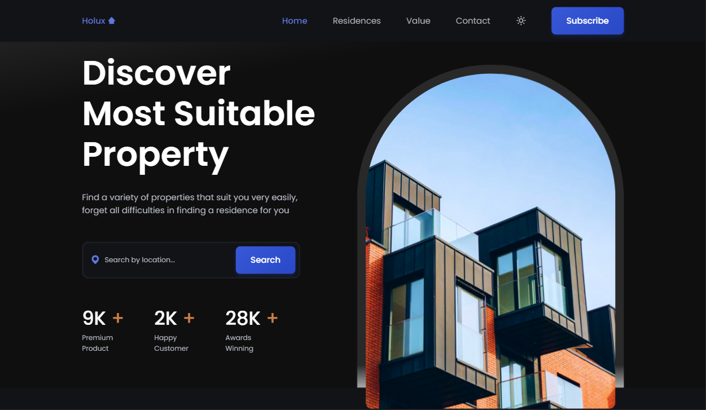

# Holux-Web-Site

Website de uma imobiliária fictícia feito a fim de estudos, nele trabalhei minhas hablidade em HTML, CSS e JavaScript, e além disso utilizei as bibliotecas Swiper e Scroll Reveal para efeitos de transição e carrosel.

# Preview

  

   

  

 

# Tecnologias e Bibliotecas usadas...

<ul>
  <li>HTML5</li>
  <li>CSS3</li>
  <li>JavaScript</li>
  <li>ScrollReveal</li>
  <li>Swiper</li>
  <li>Boxicons</li>
  <li>Google Fonts</li>
</ul>

# Essa aplicação contém...

<ul>
  <li>Responsividade</li>
  <li>Modo Dark/Ligth</li>
  <li>Efeitos de Transição</li>
  <li>Efeitos de Carrosel de Imagens</li>
</ul>
